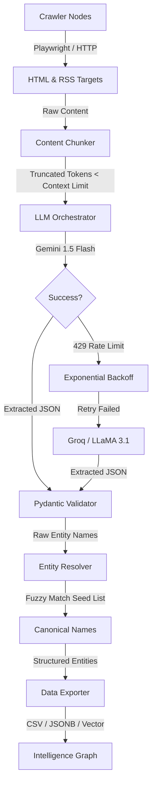

<h1 align="center">Atlas-Ingest</h1>
<p align="center"><i>A resilient, production-grade data ingestion pipeline for mapping the global AI ecosystem — startups, products, research papers, news, and jobs.</i></p>

<p align="center">
  
  
  
  
  <a href="https://docs.google.com/spreadsheets/d/1eIW1Ym208gIo5MoaTAH6wuA1R5UdGu5dXM0w-myZ4oU/edit?gid=0#gid=0" target="_blank">
    
  </a>
  
</p>

---

## 📊 Live Demo (Google Sheets)

> 🔗 **Interactive Multi-Tab Knowledge Base:**  
> <a href="https://docs.google.com/spreadsheets/d/1eIW1Ym208gIo5MoaTAH6wuA1R5UdGu5dXM0w-myZ4oU/edit?gid=0#gid=0" target="_blank" rel="noopener noreferrer"><b>Open Live Ingested Dataset in Google Sheets ↗</b></a>
>
> Includes all 6 synchronized output collections:
> - `startups` (1,000 YC entities)
> - `products` (7,772 multi-store catalog products)
> - `research_papers` (1,000 arXiv + PapersWithCode papers)
> - `news` (24h fresh tech news articles)
> - `jobs` (24h fresh remote tech job opportunities)
> - `entity_mappings` (999 cross-domain canonical fuzzy links)

---

## Table of Contents

- [Live Demo (Google Sheets)](#-live-demo-google-sheets)
- [Overview](#overview)
- [Architecture & Data Flow](#architecture--data-flow)
- [Module Deep-Dive](#module-deep-dive)
- [Installation & Setup](#installation--setup)
- [Usage & CLI Reference](#usage--cli-reference)
  - [batch-extract](#1-batch-extract--massive-one-time-data-acquisition)
  - [live-monitor](#2-live-monitor--real-time-signal-ingestion)
- [Output Reference](#output-reference)
- [Examples](#examples)
- [Project Deliverables](#project-deliverables)
- [License & Trademarks](#license--trademarks)

---

## Overview

**Atlas-Ingest** is a scalable, LLM-powered ingestion pipeline designed to construct an Intelligence Graph of the AI ecosystem. It replaces brittle, regex-heavy web scrapers with a resilient **Multi-Tier LLM Orchestration Engine** backed by smart fallback chains and deterministic entity resolution.

The pipeline enforces strict **Pydantic JSON schemas** to ensure zero-hallucination data extraction, with every record directly traceable to its source URL.

### Key Capabilities

| Capability | Description |
|---|---|
| **Multi-Source Crawling** | ArXiv API, YCombinator, ProductHunt, RSS feeds, Job boards |
| **LLM Fallback Chain** | Gemini 1.5 Flash → Groq LLaMA 3.1 → DeepSeek (automatic failover) |
| **Entity Resolution** | Fuzzy Jaro-Winkler deduplication against canonical seed lists |
| **Token-Safe Chunking** | `tiktoken`-based context window protection before every LLM call |
| **24h Freshness Filter** | RFC-822 date normalization for news & job signal ingestion |

---

## Architecture & Data Flow



---

## Module Deep-Dive

<details>
<summary><b>src/llm/orchestrator.py</b> — Multi-Tier Fallback Chain</summary>
<br>
Handles API resilience and cost-optimization. Primary extractions route through high-speed/low-cost models (e.g., <code>gemini-1.5-flash</code>). If rate-limited (429) or overloaded, it triggers <code>Tenacity</code> exponential backoffs with jitter before gracefully cascading to fallback models (<code>llama3-70b</code>, <code>deepseek</code>) via <code>LiteLLM</code>.
</details>

<details>
<summary><b>src/llm/chunking.py</b> — Context Window Protection</summary>
<br>
Prevents 413 Payload Too Large errors. Uses <code>tiktoken</code> to count tokens <i>before</i> dispatching. Strips UI bloat (navbars, footers, scripts) using <code>BeautifulSoup</code> and slices content into sliding semantic windows to guarantee prompt safety.
</details>

<details>
<summary><b>src/resolution/resolver.py</b> — Deterministic Entity Mapping</summary>
<br>
Real-world data is messy (e.g., "OpenAI", "Open AI Inc.", "OpenAI Labs"). The fuzzy-matching deduplication engine canonicalizes extracted names against a known trusted seed list using Jaro-Winkler/Levenshtein distances, logging all decisions to an Entity Mapping Log.
</details>

<details>
<summary><b>src/crawlers/news_jobs_scraper.py</b> — High-Fidelity Signal Ingestion</summary>
<br>
Bypasses LLM hallucination risks for temporal data by utilizing strict XML/RSS parsing. Enforces RFC-822 date normalization to guarantee absolute 24-hour freshness tracking across 10 distinct job boards and news feeds.
</details>

<details>
<summary><b>src/crawlers/directory_scraper.py</b> — Playwright-Powered Directory Crawler</summary>
<br>
Handles JavaScript-rendered startup and product directories (YCombinator, ProductHunt) using headless <code>Playwright</code> browsers. Supports configurable concurrency limits and automatic pagination (via <code>rel="next"</code> discovery and <code>?page=N</code> fallback) for multi-page scraping.
</details>

<details>
<summary><b>src/crawlers/arxiv_scraper.py</b> — ArXiv API Research Pipeline</summary>
<br>
Interfaces with the ArXiv API for structured research paper extraction. Automatically correlates papers with their GitHub repositories when available, linking academic research to real-world implementations.
</details>

---

## Installation & Setup

### 1. Clone & Install

```bash
git clone https://github.com/Soumadipta-Konar/Atlas-Ingest.git
cd Atlas-Ingest
pip install -r requirements.txt
playwright install
```

### 2. Configure Environment

Create a `.env` file in the project root:

```env
GEMINI_API_KEY=your_gemini_api_key
GROQ_API_KEY=your_groq_api_key
```

> **Note:** The pipeline will automatically fallback between LLM providers. You need at least one valid API key, but providing both ensures maximum resilience.

### 3. Verify Installation

```bash
python main.py --help
```

---

## Usage & CLI Reference

Atlas-Ingest exposes a clean CLI built with `argparse`. The pipeline is organized into two execution modes:

```
python main.py <command> [options]
```

| Command | Description |
|---|---|
| `batch-extract` | Massive one-time data acquisition (Startups, Products, Research Papers) |
| `live-monitor` | Real-time signal ingestion from RSS feeds (News & Jobs) |

---

### 1. `batch-extract` — Massive One-Time Data Acquisition

Crawls directories and APIs to extract structured entity data at scale.

```bash
python main.py batch-extract [--run-papers] [--run-startups] [--run-products]
                             [--topic TOPIC] [--max-records N]
                             [--startups-url URL] [--products-url URL]
                             [--ecommerce] [--seed-file PATH]
```

#### Flags

| Flag | Type | Default | Description |
|---|---|---|---|
| `--run-papers` | `bool` | `False` | Enable research paper extraction via ArXiv API |
| `--run-startups` | `bool` | `False` | Enable startup extraction from directory pages |
| `--run-products` | `bool` | `False` | Enable product extraction from directory pages |
| `--topic` | `str` | `"AI"` | Search query for ArXiv research papers |
| `--max-records` | `int` | `1000` | Target number of records to extract per category |
| `--startups-url` | `str` | `https://www.ycombinator.com/companies` | Source URL for startup directory scraping |
| `--products-url` | `str` | `https://www.producthunt.com` | Source URL for product directory scraping |
| `--ecommerce` | `bool` | `False` | Use E-commerce product schema instead of AI software schema |
| `--seed-file` | `str` | `None` | Path to a JSON file with canonical entity names for resolution |

#### Quick Start

```bash
# Extract 100 AI research papers from ArXiv
python main.py batch-extract --run-papers --topic "AI" --max-records 100
```

```bash
# Extract startups from YCombinator (default URL)
python main.py batch-extract --run-startups --max-records 50
```

```bash
# Full pipeline — papers, startups, and products in one run
python main.py batch-extract \
    --run-papers \
    --run-startups \
    --run-products \
    --topic "machine learning" \
    --max-records 500
```

```bash
# Extract e-commerce products from a custom directory
python main.py batch-extract \
    --run-products \
    --products-url "https://www.producthunt.com/topics/artificial-intelligence" \
    --ecommerce \
    --max-records 200
```

#### Output Files

| File | Description |
|---|---|
| `output/research_papers.csv` | Structured research paper entities with ArXiv metadata & GitHub links |
| `output/startups.csv` | Startup entities with founding details, funding, and descriptions |
| `output/products.csv` | Product entities with pricing, categories, and feature summaries |
| `output/entity_mappings.csv` | Resolution log mapping raw extracted names → canonical seed names |

---

### 2. `live-monitor` — Real-Time Signal Ingestion

Parses 10 RSS feeds in parallel, applying strict 24-hour freshness filters to capture only the latest news articles and job postings.

```bash
python main.py live-monitor
```

> This command has no additional flags. It automatically processes all configured news and job RSS sources.

#### Configured Sources

**News Feeds:**
| Source | Feed URL |
|---|---|
| TechCrunch | `https://techcrunch.com/feed/` |
| The Verge | `https://www.theverge.com/rss/index.xml` |
| HackerNews | `https://hnrss.org/frontpage` |
| BBC Technology | `http://feeds.bbci.co.uk/news/technology/rss.xml` |
| Wired | `https://www.wired.com/feed/category/gear/latest/rss` |

**Job Feeds:**
| Source | Feed URL |
|---|---|
| YC HackerNews Jobs | `https://hnrss.org/jobs` |
| RemoteOK | `https://remoteok.com/rss` |
| WeWorkRemotely | `https://weworkremotely.com/categories/remote-programming-jobs.rss` |
| Python.org Jobs | `https://www.python.org/jobs/feed/rss/` |
| Unstop | `https://unstop.com/feed` |

#### Output Files

| File | Description |
|---|---|
| `output/news.csv` | News articles published within the last 24 hours |
| `output/jobs.csv` | Job postings published within the last 24 hours |

---

## Output Reference

All output CSVs are written to the `output/` directory and conform to strict Pydantic-validated schemas. They are ready for direct import into Google Sheets, Airtable, or any downstream analytics tool.

```
output/
├── research_papers.csv      # ArXiv papers with GitHub correlation
├── startups.csv             # YCombinator startup entities
├── products.csv             # ProductHunt product entities
├── news.csv                 # 24h-fresh news signals
├── jobs.csv                 # 24h-fresh job signals
└── entity_mappings.csv      # Full entity resolution audit log
```

---

## Examples

Below are complete, copy-paste-ready commands for common workflows:

```bash
# 1. Quick test — grab 20 research papers on "transformers"
python main.py batch-extract --run-papers --topic "transformers" --max-records 20

# 2. Full 1000-record academic sweep on "artificial intelligence"
python main.py batch-extract --run-papers --topic "artificial intelligence" --max-records 1000

# 3. Startup discovery — scrape 100 YCombinator companies
python main.py batch-extract --run-startups --max-records 100

# 4. Combined extraction — papers + startups + products
python main.py batch-extract --run-papers --run-startups --run-products --topic "AI" --max-records 500

# 5. Real-time news & jobs feed scan
python main.py live-monitor

# 6. E-commerce product extraction from a custom URL
python main.py batch-extract --run-products --ecommerce --products-url "https://www.producthunt.com/topics/developer-tools" --max-records 150

# 7. Use a custom seed file for entity resolution
python main.py batch-extract --run-startups --max-records 100 --seed-file seeds.json
```

---

## Project Deliverables

All outputs strictly conform to the assignment grading rubric:

| Deliverable | Description | Access Link |
|---|---|---|
| **Google Sheets Live Demo** | Complete 6-tab synchronized live dataset | <a href="https://docs.google.com/spreadsheets/d/1eIW1Ym208gIo5MoaTAH6wuA1R5UdGu5dXM0w-myZ4oU/edit?gid=0#gid=0" target="_blank" rel="noopener noreferrer"><b>Open Google Sheet ↗</b></a> |
| `output/*.csv` | 100% schema-compliant datasets (startups, products, papers, news, jobs) | `output/` directory |
| `output/entity_mappings.csv` | Comprehensive Entity Mapping resolution log | [`output/entity_mappings.csv`](output/entity_mappings.csv) |
| `architecture.md` / `.pdf` | System design document with scaling strategies & topology diagrams | [`architecture.pdf`](architecture.pdf) |

---

## License & Trademarks

This project is licensed under the **MIT License**. See the [`LICENSE`](LICENSE) file for details.

<sub>Atlas-Ingest™ is a project by <a href="https://github.com/Soumadipta-Konar">Soumadipta Konar</a>. All third-party trademarks (OpenAI, YCombinator, ProductHunt, ArXiv, etc.) are the property of their respective owners and are used for identification purposes only.</sub>
