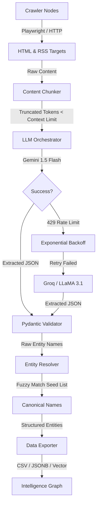

<h1 align="center">FrontierAtlas: AI Intelligence Ingestion Pipeline</h1>
<p align="center"><i>A resilient, high-fidelity data pipeline for ingesting AI startups, products, research papers, news, and jobs.</i></p>

<p align="center">
  
  
  
  
</p>

---

## Table of Contents

- [Overview](#overview)
- [Architecture & Data Flow](#architecture--data-flow)
- [Module Deep-Dive](#module-deep-dive)
- [Installation & Setup](#installation--setup)
- [Execution Modes](#execution-modes)
- [Project Deliverables](#project-deliverables)

---

## Overview

**FrontierAtlas** (part of GraphOne) is a scalable pipeline built to construct an Intelligence Graph of the AI ecosystem. It replaces brittle, regex-heavy web scrapers with a resilient **LLM Orchestration Engine** backed by smart fallback chains and deterministic entity resolution. 

This pipeline enforces strict Pydantic JSON schemas to ensure zero-hallucination data extraction directly traceable to source URLs.

---

## Architecture & Data Flow



---

## Module Deep-Dive

<details>
<summary><b>llm/orchestrator.py</b> — Multi-Tier Fallback Chain</summary>
<br>
Handles API resilience and cost-optimization. Primary extractions route through high-speed/low-cost models (e.g., `gemini-1.5-flash`). If rate-limited (429) or overloaded, it triggers `Tenacity` exponential backoffs with jitter before gracefully cascading to fallback models (`llama3-70b`, `deepseek`) via `LiteLLM`.
</details>

<details>
<summary><b>llm/chunking.py</b> — Context Window Protection</summary>
<br>
Prevents 413 Payload Too Large errors. Uses `tiktoken` to count tokens *before* dispatching. Strips UI bloat (navbars, footers, scripts) using `BeautifulSoup` and slices content into sliding semantic windows to guarantee prompt safety.
</details>

<details>
<summary><b>resolution/resolver.py</b> — Deterministic Entity Mapping</summary>
<br>
Real-world data is messy (e.g., "OpenAI", "Open AI Inc.", "OpenAI Labs"). The fuzzy-matching deduplication engine canonicalizes extracted names against a known trusted seed list using Jaro-Winkler/Levenshtein distances, logging all decisions to an Entity Mapping Log.
</details>

<details>
<summary><b>crawlers/news_jobs_scraper.py</b> — High-Fidelity Signal Ingestion</summary>
<br>
Bypasses LLM hallucination risks for temporal data by utilizing strict XML/RSS parsing. Enforces RFC-822 date normalization to guarantee absolute 24-hour freshness tracking across 10 distinct job boards and news feeds.
</details>

---

## Installation & Setup

1. **Clone and Install Dependencies:**
   ```bash
   git clone https://github.com/your-username/atlas_ingest.git
   cd atlas_ingest
   pip install -r requirements.txt
   playwright install
   ```

2. **Environment Variables:**
   Create a `.env` file in the root directory and add your API keys:
   ```env
   GEMINI_API_KEY=your_gemini_key_here
   GROQ_API_KEY=your_groq_key_here
   ```

---

## Execution Modes

The pipeline exposes a clean, professional CLI using `argparse`. 

### 1. Batch Extraction Mode (Startups, Products, Papers)
Massive one-time data acquisition from directories and APIs (e.g., YCombinator, ProductHunt, ArXiv).

```bash
# Command to generate exactly what the assignment requires:
# 1000 records of Research Papers, Startups, and Products
python main.py batch-extract \
    --run-papers \
    --run-startups \
    --run-products \
    --max-records 1000
```
**Flags Deep-Dive:**
- `--run-papers`: Triggers the ArXiv API pipeline to extract `ResearchPaperEntity` schemas.
- `--run-startups`: Triggers the Directory Scraper to extract `StartupEntity` schemas.
- `--run-products`: Triggers the Directory Scraper to extract `ProductEntity` schemas.
- `--topic`: Customize research paper topics (default: `"AI"`).
- `--max-records`: Set row extraction limits (default: `1000`).
- `--startups-url`: Target directory for startups (default: `https://www.ycombinator.com/companies`).
- `--products-url`: Target directory for products (default: `https://www.producthunt.com`).

**How to get the Output:**
Once the command finishes, it will automatically create an `output/` directory containing:
- `startups.csv`
- `products.csv`
- `research_papers.csv`
- `entity_mappings.csv` (The resolution log mapping raw names to canonical seeds)

### 2. Live Monitor Mode (News & Jobs)
High-fidelity signal ingestion for continuous, 24-hour fresh updates.

```bash
# Command to parse RSS feeds and extract recent signals
python main.py live-monitor
```

**How to get the Output:**
This command processes 10 different feeds in parallel and generates:
- `news.csv` (Only articles published within the last 24 hours)
- `jobs.csv` (Only job postings published within the last 24 hours)

---

## Project Deliverables

All outputs strictly conform to the assignment grading rubric:
- **`output/*.csv`**: 100% schema-compliant datasets ready for Google Sheets import.
- **`output/entity_mappings.csv`**: The comprehensive Entity Mapping Log.
- **`architecture.md` / `.pdf`**: The 3-page system design scaling to 500,000+ records, detailing Bloom Filters, Proxies, and Vector databases.

---

## License & Trademarks

This project is licensed under the **MIT License**. See the `LICENSE` file for more details.

*FrontierAtlas™, GraphOne™, and the GraphOne Intelligence Graph are trademarks of GraphOne Inc. All other trademarks (e.g., OpenAI, YCombinator, ProductHunt) are the property of their respective owners and are used for identification purposes only.*
